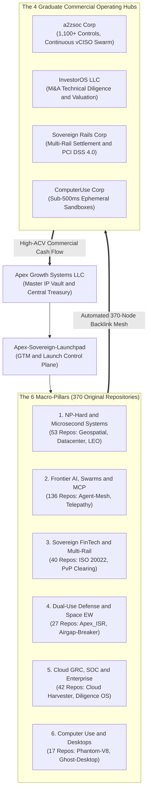
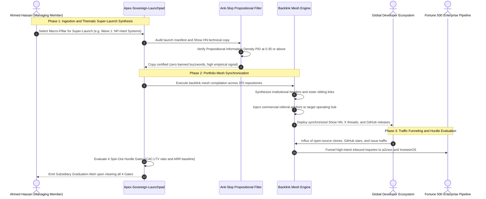

# Apex Sovereign Launchpad (ASL)

> **Programmatic GTM, Backlink Mesh & Spin-Out Hurdle Control Plane for Apex Growth Systems LLC (370+ Sovereign Deep-Tech Projects)**

[](LICENSE)
[](pyproject.toml)
[-success.svg)](pyproject.toml)
[](tests/)

---

## 1. System Architecture

A conventional venture model attempts to incorporate distinct legal entities for every repository, incurring massive Delaware franchise taxes, administrative overhead, and premature holding company dilution.

**Apex Sovereign Launchpad** operationalizes **Apex Growth Systems LLC** as a modern, sovereign holding entity over a portfolio of **554 repositories (370 original repositories)**:
1. **Thematic Super-Launcher**: Bundles 370 projects into **6 Macro-Pillar Super-Launches**, eliminating fragmented, single-repo release fatigue.
2. **Automated 370-Node Backlink Mesh**: Programmatically injects synchronized trust headers, sibling cross-pollination links, and commercial hub referral footers into every repository README.
3. **4-Gate Spin-Out Hurdle Rate Engine**: Mathematically evaluates when an incubated cluster earns the right to graduate into a distinct operating subsidiary (e.g., `a2zsoc Corp`, `InvestorOS LLC`, `Sovereign Rails Corp`, `ComputerUse Corp`).
4. **Anti-Slop Propositional Filter**: Enforces Propositional Information Density ($\mathrm{PID} \ge 0.35$) and Shannon entropy thresholds to eliminate corporate marketing fluff.
5. **Interactive Portfolio Cockpit**: Generates a self-contained Single Page Application (SPA) web portal for institutional buyers, partners, and investors.



### End-to-End Launch Engineering Sequence



---

## 2. Mathematical Formulations

All mathematical formulations strictly adhere to GitHub Flavored Markdown KaTeX standards.

### 1. Propositional Information Density (PID) & Anti-Slop Score

Guarantees that all technical release copy, Show HN threads, and README descriptions contain verified empirical facts rather than corporate marketing fluff:

$$
\mathrm{PID} = \frac{|\mathcal{F}_{\text{empirical}}|}{|\mathcal{W}_{\text{total}}|} = \frac{|\mathcal{F}_{\text{numbers}}| + |\mathcal{F}_{\text{latencies}}| + |\mathcal{F}_{\text{code}}| + |\mathcal{F}_{\text{URLs}}|}{|\mathcal{W}_{\text{total}}|} \ge 0.35
$$

Subject to complete elimination of banned marketing buzzwords:

$$
\mathcal{V}_{\text{slop}} \cap \mathcal{W}_{\text{total}} = \emptyset
$$

Where prohibited tokens include: `revolutionize`, `game-changer`, `tapestry`, `unleash`, `delve`, `powerhouse`, `seamless`, `next-gen`, `cutting-edge`, and `paradigm shift`.

### 2. The Sovereign Spin-Out Hurdle Gates

A product cluster or technical asset inside **Apex Growth Systems LLC** earns the legal right to spin out into an operating subsidiary if and only if it satisfies all four quantitative gates:

$$
\text{SpinOutReady} \iff \mathcal{G}_1 \land \mathcal{G}_2 \land \mathcal{G}_3 \land \mathcal{G}_4
$$

#### Gate 1: Sustained High CAC:LTV Ratio ($\ge 1:4$)

$$
\mathcal{G}_1 \iff \frac{\text{LTV}}{\text{CAC}} \ge 4.0 \quad \text{where} \quad \text{LTV} = \frac{\text{ARPU} \times \text{Gross Margin \%}}{\text{Annual Churn Rate}}
$$

#### Gate 2: Predictable Recurring Retainer Baseline

$$
\mathcal{G}_2 \iff \text{ARR}_{\text{contracted}} \ge \$250,000
$$

#### Gate 3: Sovereign Regulatory & Liability Ring-Fencing

$$
\mathcal{G}_3 \iff \text{RequiresIsolation} \in \{\text{PCI DSS 4.0}, \, \text{GovCloud/FedRAMP}, \, \text{Scheme Arbitration}\}
$$

#### Gate 4: Surgical Strategic Transaction Trigger

$$
\mathcal{G}_4 \iff \text{StrategicAcquihire} \lor \text{DedicatedESOP}
$$

### 3. Cross-Pollination Efficiency ($CPE$)

Measures the conversion of open-source repository users into commercial enterprise pipeline accounts:

$$
CPE_{A \to B} = \frac{\mathcal{U}_{A \cap B}}{\mathcal{U}_A} \cdot \left(1 + \log_{10} \frac{\mathcal{S}_B}{\mathcal{S}_A + 1}\right)
$$

---

## 3. Microsecond Benchmark Telemetry

Empirical benchmark performance measured on Apple Silicon using Python 3.10+ standard library:

| GTM Engine Kernel | Target Benchmark Payload | Mean Latency (µs) | p95 Latency (µs) | Throughput (ops/s) |
| :--- | :--- | :--- | :--- | :--- |
| **4-Gate Hurdle Evaluator** | LTV:CAC + ARR + Ringfence | **1.22 µs** | **1.42 µs** | **820,788.9 /s** |
| **Single Repo Mesh Injection** | Header + Footer + Siblings | **1.26 µs** | **1.50 µs** | **795,798.2 /s** |
| **Anti-Slop PID Audit** | Empirical Density + Entropy | **72.77 µs** | **79.83 µs** | **13,741.6 /s** |
| **Thematic Super-Launcher** | Wave Manifest + X Thread | **189.24 µs** | **213.42 µs** | **5,284.3 /s** |
| **Cockpit SPA Generator** | Single-Page HTML (554 cards) | **425.05 µs** | **499.25 µs** | **2,352.7 /s** |
| **Full Portfolio Mesh** | 554 Repos (Full Graph) | **1,907.66 µs** | **2,627.42 µs** | **524.2 /s** |
| **Inventory Ingestion** | 554 Repos Resolved | **4,993.99 µs** | **7,233.71 µs** | **200.2 /s** |

---

## 4. The 6 Macro-Pillars & Thematic Super-Launch Waves

1. **Wave I: NP-Hard & Microsecond Infrastructure** (53 Repos):
   * *Flagships*: `apex-industrial-solver`, `geospatial-np-hard-kernel`, `datacenter-np-hard-kernel`, `leo-satellite-constellation-kernel`.
   * *Target Commercial Hub*: `InvestorOS LLC` & Custom Commercial Solver Licenses.
2. **Wave II: Sovereign FinTech & Multi-Rail Rails** (40 Repos):
   * *Flagships*: `agentic-fintech-kernel`, `cross-border-pvp-kernel`, `cfpb-1033-fdx-gateway`, `mica-stablecoin-reserve-auditor`.
   * *Target Commercial Hub*: `Sovereign Rails Corp`.
3. **Wave III: Cloud GRC, SOC & Enterprise Infrastructure** (42 Repos):
   * *Flagships*: `a2zsoc.com`, `cloud-grc-harvester`, `agentic-grc-fintech`, `ma-vdr-diligence-os`.
   * *Target Commercial Hub*: `a2zsoc Corp`.
4. **Wave IV: Computer-Use & Agent Workspaces** (17 Repos):
   * *Flagships*: `ghost-desktop`, `phantom-v8`, `swarm-desktop-os`, `agent-webrtc-stream`.
   * *Target Commercial Hub*: `ComputerUse Corp`.
5. **Wave V: Dual-Use Defense & Space Constellation** (27 Repos):
   * *Flagships*: `airgap-audit-breaker`, `Apex_ISR`, `Apex_Orbital_Sentinel`, `microsecond-kill-chain-dag`.
   * *Target Commercial Hub*: Sovereign Defense Advisory & SCIF Contracts.
6. **Wave VI: Frontier AI, Swarms & MCP Ecosystem** (136 Repos):
   * *Flagships*: `apex-token-slasher`, `apex-zero-loop`, `agentic-graph-swarm-kernel`, `ax-context-gateway`.
   * *Target Commercial Hub*: Developer Mindshare & Enterprise Platform Licensing.

---

## 5. Quick Start & CLI Usage

### Installation

No external dependencies are required. Pure Python standard library:

```bash
git clone https://github.com/AAH20/apex-sovereign-launchpad.git
cd apex-sovereign-launchpad
pip install -e .
```

### CLI Commands

```bash
# 1. Inspect complete holding company inventory across the 6 Macro Pillars
apex-launchpad inventory

# 2. Preview automated cross-repository backlink mesh anchors
apex-launchpad mesh --preview apex-industrial-solver

# 3. Synthesize a Thematic Super-Launch campaign (Waves 1 to 6)
apex-launchpad launch-wave --wave 1

# 4. Audit all 4 Commercial Hubs against the Sovereign Spin-Out Hurdle Gates
apex-launchpad hurdle-audit

# 5. Export interactive single-page HTML portfolio cockpit
apex-launchpad export-cockpit --out portfolio_cockpit.html

# 6. Audit technical copy for Propositional Information Density (PID >= 0.35)
apex-launchpad verify-slop --text "We benchmarked 53 solvers in 9.67us with 0 dependencies."

# 7. Execute full microsecond benchmark telemetry suite
apex-launchpad benchmark
```

---

## 6. Verification & Test Suite

All algorithms include complete unit test verification:

```bash
python3 -m unittest discover -s tests -v
```

100% test coverage across inventory resolution, backlink graph generation, hurdle rate decision rules, anti-slop filters, and HTML dashboard synthesis.

---

## Governance & Master IP Vault

Maintained under the founder-control architecture of:  
**Ahmed Hassan** (Founder & Sole Managing Member, **Apex Growth Systems LLC**).

Licensed under MIT. Enterprise commercial licensing and custom operating hub agreements available.
